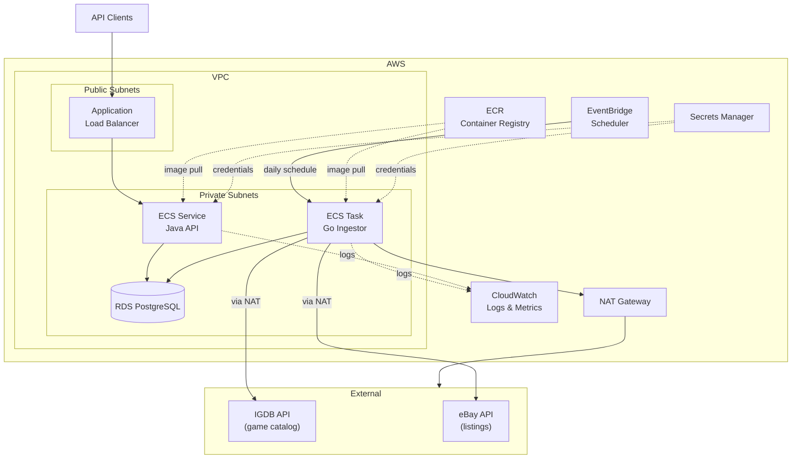

# RetroTrends Architecture

## Overview

RetroTrends tracks historical sold prices for retro video games. The system has two primary components:

1. **Ingestor** (Go) — a scheduled job that pulls retro game listings from eBay, stores them, and revisits pending listings to confirm sold status.
2. **API** (Java/Spring Boot) — a REST service that exposes price history and game catalog data to consumers.

Both services share a single **PostgreSQL** database (AWS RDS) and run as containers on **AWS ECS Fargate**.

---

## System Diagram



---

## Component Breakdown

### Ingestor (Go)

A single Go binary with three subcommands, each triggered independently:

| Subcommand | Trigger | Purpose |
|------------|---------|---------|
| `backfill` | Manual / one-time | Fetches all games for a given `--platform` from IGDB and populates the `games` table (defaults to GameCube; see `internal/platform` for the full supported list) |
| `ingest` | EventBridge daily at 02:00 UTC | Searches eBay for new listings for every tracked game, across all platforms already in the `games` table; stores them as `pending` |
| `revisit` | EventBridge daily at 04:00 UTC | Checks each `pending` listing and updates sold/ended status |

The `ingest` and `revisit` jobs are independent ECS Scheduled Tasks. The `backfill` command is run manually as a one-off ECS task when the game catalog needs to be seeded or refreshed.

**Key design decisions:**
- The ingestor is stateless — all state lives in PostgreSQL. The container can be retried or restarted safely.
- API keys for eBay and IGDB are injected via environment variables sourced from Secrets Manager at task start.
- The binary logs structured JSON to stdout; CloudWatch Logs collects and retains these.

### API (Java / Spring Boot)

A long-running ECS Service (minimum 1 task, auto-scalable) behind an Application Load Balancer. It is read-only against the database — it never writes.

**Stack:** Spring Boot 3.x, Spring Data JDBC (or JPA), PostgreSQL JDBC driver.

**Networking:** ALB listens on port 443 (TLS termination), forwards to the ECS service on port 8080. ECS tasks live in private subnets; only the ALB is internet-facing.

See [api-reference.md](api-reference.md) for endpoint documentation.

### PostgreSQL (AWS RDS)

- Engine: PostgreSQL 16
- Instance class: `db.t4g.medium` (start small, scale up)
- Storage: 20 GB gp3, autoscaling enabled
- Deployed in private subnets; no public accessibility
- Credentials stored in Secrets Manager and rotated automatically
- Daily automated backups with 7-day retention

See [data-model.md](data-model.md) for schema documentation.

---

## AWS Infrastructure Summary

| Service | Role |
|---------|------|
| ECS Fargate | Runs ingestor tasks and API service (serverless containers) |
| RDS PostgreSQL | Primary data store |
| ECR | Stores Docker images for both services |
| ALB | Internet-facing entry point for the API |
| EventBridge Scheduler | Triggers daily ingest and revisit ECS tasks |
| Secrets Manager | Stores DB credentials and third-party API keys |
| VPC + NAT Gateway | Network isolation; NAT allows outbound calls to eBay/IGDB |
| CloudWatch | Log aggregation and metric collection |

---

## Ingestor Job Design

### Job 1: IGDB Backfill (`backfill`)

This is a prerequisite for the ingestor. It must be run before any eBay ingestion begins.

1. Call IGDB's `games` endpoint, filtered to `platform = <selected platform's IGDB ID>` (via `--platform`, default `gamecube`), paginating until all results are consumed.
2. For each game, upsert into the `games` table (keyed on `igdb_id`), storing the selected platform's canonical name.
3. Log counts of inserted vs. updated records.

IGDB uses OAuth 2.0 client credentials. The access token is fetched at startup and cached for the duration of the job.

### Job 2: eBay Listing Ingest (`ingest`)

**Goal:** Discover new eBay listings for each tracked game and store them as `pending`.

**Flow:**
1. Load all games from the `games` table.
2. For each game:
   a. Build a search query: `"{game.title}" {platform.searchTerm}`, where the search term is looked up from the game's stored `platform` name (e.g. `"gamecube"`, `"snes"`)
   b. Call eBay's Browse API `search` endpoint, up to **5 pages** (50 items/page = 250 listings/game).
   c. For each listing returned:
      - Skip if `ebay_listing_id` already exists in `listings` (idempotent).
      - Parse condition from the eBay `condition` field and listing title (see Condition Parsing below).
      - Insert a new row with `status = 'pending'`.
3. Log a summary: games processed, listings found, listings inserted.

**eBay API budget for this job:** Approximately 1,000 calls (200 games × 5 pages). This leaves ~4,000 calls for the revisit job.

### Job 3: Sold Status Revisit (`revisit`)

**Goal:** Determine which pending listings have sold and record the final price.

**Flow:**
1. Query all rows from `listings` where `status = 'pending'`.
2. For each listing, call eBay's Browse API `getItem` endpoint using the stored `ebay_listing_id`.
3. Inspect the response:
   - `buyingOptions` contains `AUCTION` and `price` reflects current bid → still active, update `last_checked_at`.
   - Item `itemEndDate` is in the past and `soldQuantity > 0` → sold. Update `status = 'sold'`, `sold_price`, `sold_at`.
   - Item not found or `soldQuantity = 0` with end date in past → ended unsold. Update `status = 'ended_unsold'`.
4. Respect API budget: if remaining daily calls are exhausted, stop and resume the next day (oldest `last_checked_at` first).

**Priority ordering:** listings are processed oldest-`last_checked_at`-first, so no listing is starved indefinitely.

**API budget for this job:** Up to ~4,000 calls/day. At scale, the system can check ~4,000 unique listings per day. Listings that sell quickly (within 24–48 hours) will be resolved within 1–2 revisit cycles.

### Condition Parsing

eBay returns a `condition` field with values like `"New"`, `"Used"`, `"Very Good"`, etc. These are mapped to the internal condition vocabulary:

| eBay Condition | Internal Condition |
|---|---|
| `New` (with sealed/factory in title) | `sealed` |
| `New` | `cib` (assume complete) |
| `Used`, `Very Good`, `Good`, `Acceptable` | parsed from title |
| Title contains: `CIB`, `Complete`, `Complete in Box`, `w/ Box` | `cib` |
| Title contains: `Sealed`, `Factory Sealed`, `New Sealed` | `sealed` |
| Title contains: `Disc Only`, `Game Only`, `Cartridge Only`, `No Manual` | `loose` |
| No match | `unknown` |

Title-based parsing is applied after the eBay condition field as a refinement.

---

## Data Flow Summary

```
IGDB API  ──[backfill]──▶  games table

eBay API  ──[ingest]───▶  listings table (status=pending)
          ──[revisit]──▶  listings table (status=sold|ended_unsold)

listings (status=sold)  ──▶  API  ──▶  Clients
```

---

## Environment Variables

Both services receive their configuration via environment variables. Sensitive values are stored in Secrets Manager and injected at container start.

### Ingestor

| Variable | Source | Description |
|----------|--------|-------------|
| `DATABASE_URL` | Secrets Manager | PostgreSQL connection string |
| `EBAY_CLIENT_ID` | Secrets Manager | eBay OAuth client ID |
| `EBAY_CLIENT_SECRET` | Secrets Manager | eBay OAuth client secret |
| `IGDB_CLIENT_ID` | Secrets Manager | IGDB (Twitch) client ID |
| `IGDB_CLIENT_SECRET` | Secrets Manager | IGDB (Twitch) client secret |
| `EBAY_DAILY_CALL_LIMIT` | Task definition | Budget cap (default: `5000`) |
| `INGEST_MAX_PAGES` | Task definition | Pages per game (default: `5`) |

### API

| Variable | Source | Description |
|----------|--------|-------------|
| `DATABASE_URL` | Secrets Manager | PostgreSQL connection string |
| `SERVER_PORT` | Task definition | HTTP port (default: `8080`) |
