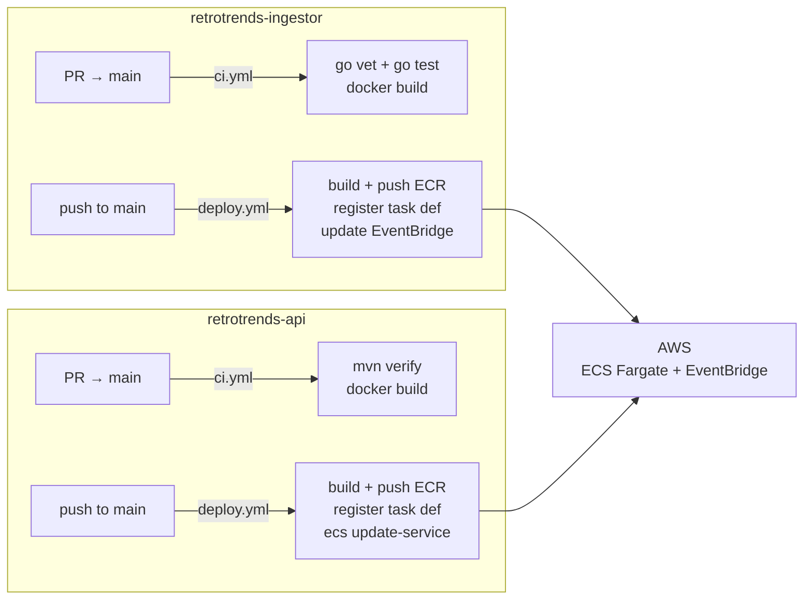

# CI/CD

RetroTrends uses **GitHub Actions** for CI/CD. The ingestor and API live in separate repositories, each with their own independent pipelines that deploy to a shared AWS environment.

---

## Branching Strategy

```
feature/* ──► PR ──► main ──► deploy to prod
```

- All development happens on `feature/*` branches.
- Pull requests to `main` trigger CI checks only (no image push, no deployment).
- Merges to `main` trigger the full CD pipeline automatically.

---

## Ingestor Repository (`retrotrends-ingestor`)

### Workflow Files

| File | Trigger | Purpose |
|------|---------|---------|
| `.github/workflows/ci.yml` | PR to `main` | Lint, test, build image (no push) |
| `.github/workflows/deploy.yml` | Push to `main` | Build, push to ECR, update ECS |

### CI Pipeline (`.github/workflows/ci.yml`)

Runs on every pull request to `main`.

1. `go vet ./...` — static analysis
2. `go test ./...` — unit tests
3. `docker build` — verify the image builds (image is not pushed)

### CD Pipeline (`.github/workflows/deploy.yml`)

Runs on every push to `main`.

1. Authenticate to AWS via **OIDC** (see [AWS Credentials](#aws-credentials))
2. `docker build` — tag image with `${{ github.sha }}`
3. `docker push` to ECR repository `retrotrends-ingestor`
4. Register a new ECS task definition revision (replace the image URI with the new tag)
5. Update both **EventBridge Scheduler** targets to point to the new task definition revision:
   - `retrotrends-ingest` (daily 02:00 UTC)
   - `retrotrends-revisit` (daily 04:00 UTC)

---

## API Repository (`retrotrends-api`)

### Workflow Files

| File | Trigger | Purpose |
|------|---------|---------|
| `.github/workflows/ci.yml` | PR to `main` | Build, test, verify image builds |
| `.github/workflows/deploy.yml` | Push to `main` | Build, push to ECR, rolling deploy |

### CI Pipeline (`.github/workflows/ci.yml`)

Runs on every pull request to `main`.

1. `mvn verify` — compiles, runs unit tests, packages the JAR
2. `docker build` — verify the image builds (image is not pushed)

### CD Pipeline (`.github/workflows/deploy.yml`)

Runs on every push to `main`.

1. Authenticate to AWS via **OIDC**
2. `docker build` — tag image with `${{ github.sha }}`
3. `docker push` to ECR repository `retrotrends-api`
4. Register a new ECS task definition revision (replace the image URI with the new tag)
5. `aws ecs update-service --force-new-deployment` — rolling update behind the ALB

**Database migrations** are handled automatically: Flyway is bundled into the Spring Boot application and runs on startup. When ECS replaces the old tasks with new ones, Flyway applies any pending migrations before the container becomes healthy and is registered with the ALB. No separate migration step is required.

---

## AWS Credentials

Both pipelines use **GitHub OIDC** — no long-lived AWS access keys are stored as secrets.

Each repository assumes a dedicated IAM role scoped to that specific GitHub repo:

```
sts:AssumeRoleWithWebIdentity
  Condition:
    StringEquals:
      token.actions.githubusercontent.com:sub: "repo:jakebuhite/retrotrends-ingestor:ref:refs/heads/main"
```

The ingestor IAM role requires:
- `ecs:RegisterTaskDefinition`
- `ecs:DescribeTaskDefinition`
- `scheduler:UpdateSchedule`
- `ecr:GetAuthorizationToken`, `ecr:BatchCheckLayerAvailability`, `ecr:PutImage`, etc.
- `iam:PassRole` (to pass the ECS task execution role)

The API IAM role requires:
- `ecs:RegisterTaskDefinition`
- `ecs:UpdateService`
- `ecr:GetAuthorizationToken`, `ecr:BatchCheckLayerAvailability`, `ecr:PutImage`, etc.
- `iam:PassRole`

---

## GitHub Secrets

The following secrets must be configured in each repository under **Settings → Secrets and variables → Actions**.

| Secret | Both repos | Description |
|--------|-----------|-------------|
| `AWS_ROLE_ARN` | Yes | IAM role ARN for OIDC (different per repo) |
| `ECR_REGISTRY` | Yes | ECR registry URL (e.g. `123456789.dkr.ecr.us-east-1.amazonaws.com`) |
| `ECR_REPOSITORY` | Yes | `retrotrends-ingestor` or `retrotrends-api` |
| `ECS_CLUSTER` | Yes | Shared ECS cluster name |
| `AWS_REGION` | Yes | e.g. `us-east-1` |
| `INGEST_TASK_DEF` | Ingestor only | ECS task definition family name for the ingest job |
| `REVISIT_TASK_DEF` | Ingestor only | ECS task definition family name for the revisit job |
| `API_TASK_DEF` | API only | ECS task definition family name for the API service |
| `API_SERVICE_NAME` | API only | ECS service name for the API |

---

## Rollback

**Ingestor:** Re-run `deploy.yml` on a prior commit via `workflow_dispatch`, or manually update the two EventBridge Scheduler targets to reference the previous task definition revision number.

**API:** Re-run `deploy.yml` on a prior commit via `workflow_dispatch`, or manually update the ECS service to use the previous task definition revision. The ALB health check gates traffic — no traffic will shift to a revision that fails to become healthy.

**Database migrations:** Flyway migrations are forward-only. If a migration introduced a breaking schema change, a new migration must be written to revert it. This is by design — rollback of applied migrations is not supported.

---

## Diagram


